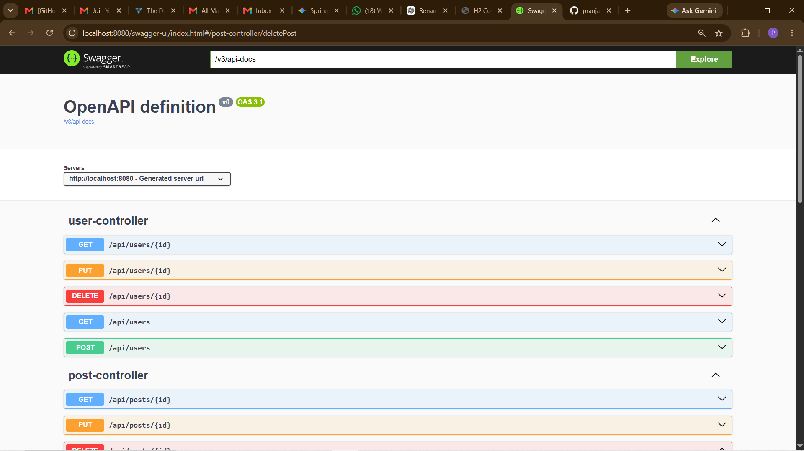
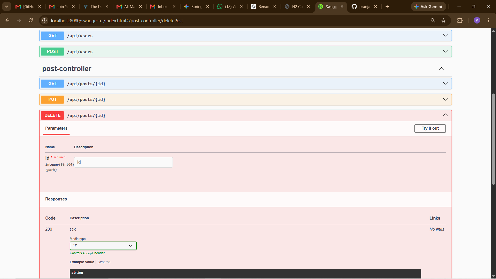
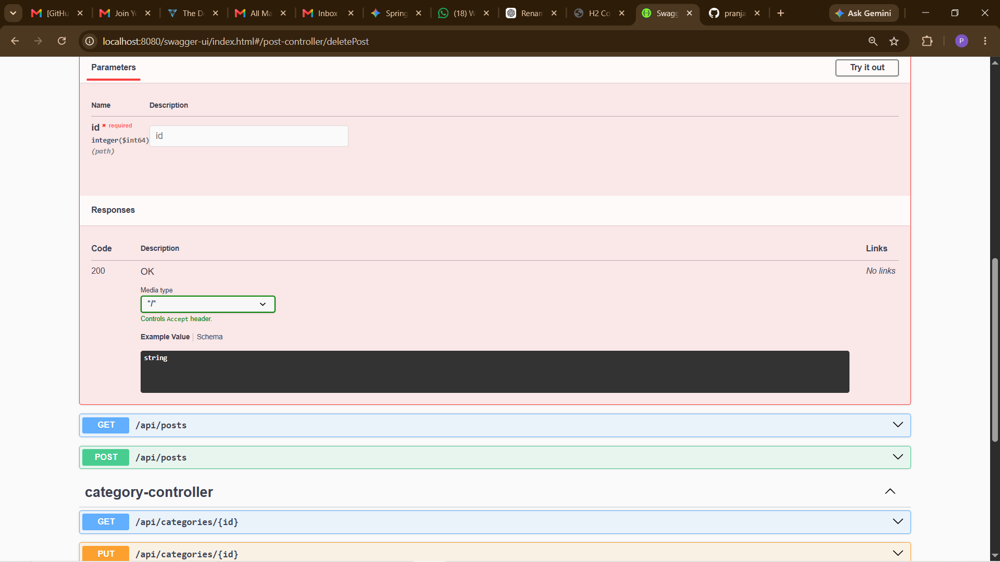
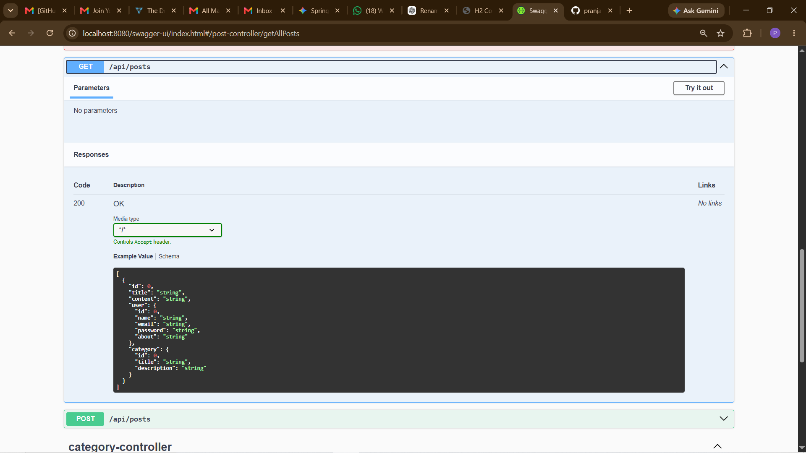
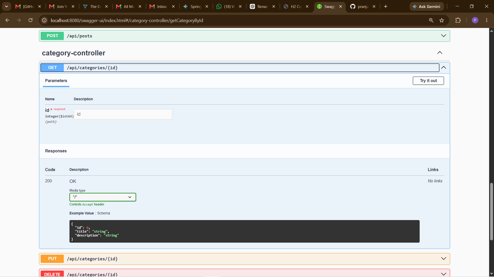
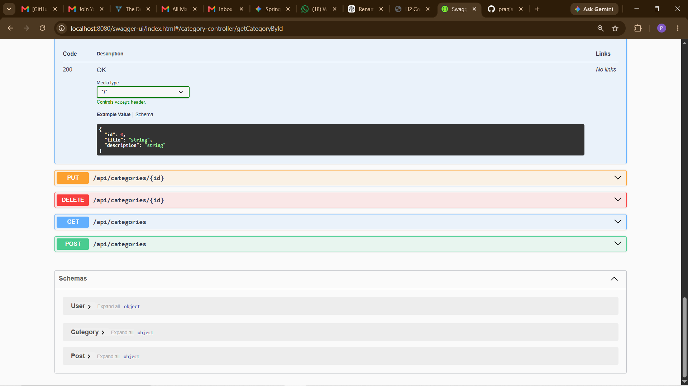

<<<<<<< HEAD
# Blog Management REST API

[](https://www.oracle.com/java/)
[](https://spring.io/projects/spring-boot)
[](LICENSE)

A secure and scalable RESTful Blog Management System built using Spring Boot, providing APIs for creating, reading, updating, and deleting blog posts with proper architecture and best practices.

## Table of Contents

- [Project Overview](#project-overview)
- [Key Features](#key-features)
- [Technologies Used](#technologies-used)
- [Project Structure](#project-structure)
- [Installation Guide](#installation-guide)
- [Usage Instructions](#usage-instructions)
- [Screenshots](#screenshots)
- [API Endpoints](#api-endpoints)
- [Configuration](#configuration)
- [Testing](#testing)
- [Contributing Guidelines](#contributing-guidelines)
- [License](#license)

## Project Overview

The Blog Management REST API is a comprehensive backend solution designed to manage blog content efficiently. Built with Spring Boot, it follows a layered architecture pattern ensuring clean separation of concerns, maintainability, and testability. The API supports full CRUD operations for posts, users, and categories, making it suitable for integration with modern frontend frameworks like React or Angular.

## Key Features

- **User Management**: Create, read, update, and delete user accounts
- **Post Management**: Full CRUD operations for blog posts
- **Category Management**: Organize posts with categories
- **RESTful API Design**: Follows industry-standard REST conventions
- **Layered Architecture**: Clean separation between Controllers, Services, and Repositories
- **Database Support**: H2 (in-memory) for development, PostgreSQL for production
- **API Documentation**: Swagger/OpenAPI integration for easy API exploration
- **Validation**: Input validation using Spring Validation
- **DevTools**: Hot reload support for development

## Technologies Used

| Technology | Version | Purpose |
|------------|---------|---------|
| Java | 21 | Programming Language |
| Spring Boot | 3.5.3 | Application Framework |
| Spring Web | - | REST API endpoints |
| Spring Data JPA | - | Database ORM |
| Hibernate | - | JPA Implementation |
| H2 Database | - | In-memory database (development) |
| PostgreSQL | - | Production database |
| Maven | - | Dependency Management |
| Lombok | - | Boilerplate code reduction |
| SpringDoc OpenAPI | 2.8.9 | API Documentation |

## Project Structure

```
blog-api/
│
├── src/
│   ├── main/
│   │   ├── java/com/blogapi/
│   │   │   ├── BlogApiApplication.java     # Main Application Entry Point
│   │   │   ├── controller/
│   │   │   │   ├── UserController.java     # User REST endpoints
│   │   │   │   ├── PostController.java     # Post REST endpoints
│   │   │   │   └── CategoryController.java # Category REST endpoints
│   │   │   ├── service/
│   │   │   │   ├── UserService.java
│   │   │   │   ├── UserServiceImpl.java
│   │   │   │   ├── PostService.java
│   │   │   │   ├── PostServiceImpl.java
│   │   │   │   ├── CategoryService.java
│   │   │   │   └── CategoryServiceImpl.java
│   │   │   ├── repository/
│   │   │   │   ├── UserRepository.java
│   │   │   │   ├── PostRepository.java
│   │   │   │   └── CategoryRepository.java
│   │   │   └── model/
│   │   │       └── entity/
│   │   │           ├── User.java
│   │   │           ├── Post.java
│   │   │           └── Category.java
│   │   └── resources/
│   │       └── application.properties
│   └── test/
│       └── java/com/blogapi/
│           └── BlogApiApplicationTests.java
├── pom.xml
├── mvnw
├── mvnw.cmd
└── .gitignore
```

## Installation Guide

### Prerequisites

- Java 21 or higher
- Maven 3.6+ (or use included Maven wrapper)
- PostgreSQL (optional, for production)

### Steps

1. **Clone the Repository**

```bash
git clone https://github.com/pranjalKumarglbtim/BlogManagementRestAPI.git
cd BlogManagementRestAPI
```

2. **Configure Database**

For development (H2 in-memory database is pre-configured):

```properties
# src/main/resources/application.properties
spring.datasource.url=jdbc:h2:mem:blogdb
spring.datasource.driverClassName=org.h2.Driver
spring.datasource.username=sa
spring.datasource.password=
```

For PostgreSQL production:

```properties
spring.datasource.url=jdbc:postgresql://localhost:5432/blogdb
spring.datasource.username=your_username
spring.datasource.password=your_password
spring.jpa.hibernate.ddl-auto=update
```

3. **Build the Project**

```bash
./mvnw clean install
```

4. **Run the Application**

```bash
./mvnw spring-boot:run
```

Or run directly:

```bash
java -jar target/blog-api-0.0.1-SNAPSHOT.jar
```

## Usage Instructions

### Accessing the API

Once the application is running, the API will be available at:

```
http://localhost:8080
```

### Swagger UI

API documentation is available at:

```
http://localhost:8080/swagger-ui/index.html
```

### H2 Console

Access the H2 in-memory database console at:

```
http://localhost:8080/h2-console
```

- JDBC URL: `jdbc:h2:mem:blogdb`
- Username: `sa`
- Password: (leave empty)

## Screenshots

### Swagger API Documentation


*API Documentation via Swagger UI*



### Database Console



### API Endpoints

**User API Endpoint**



**Post API Endpoint**



**Category API Endpoint**



## API Endpoints

### User Endpoints

| Method | Endpoint | Description |
|--------|----------|-------------|
| POST | `/api/users` | Create a new user |
| GET | `/api/users` | Get all users |
| GET | `/api/users/{id}` | Get user by ID |
| PUT | `/api/users/{id}` | Update user |
| DELETE | `/api/users/{id}` | Delete user |

**Create User Request:**

```json
{
  "name": "John Doe",
  "email": "john@example.com",
  "password": "securepassword",
  "about": "Software Developer"
}
```

### Post Endpoints

| Method | Endpoint | Description |
|--------|----------|-------------|
| POST | `/api/posts` | Create a new post |
| GET | `/api/posts` | Get all posts |
| GET | `/api/posts/{id}` | Get post by ID |
| PUT | `/api/posts/{id}` | Update post |
| DELETE | `/api/posts/{id}` | Delete post |

**Create Post Request:**

```json
{
  "title": "My First Blog",
  "content": "This is the content of my first blog post",
  "user": {
    "id": 1
  },
  "category": {
    "id": 1
  }
}
```

### Category Endpoints

| Method | Endpoint | Description |
|--------|----------|-------------|
| POST | `/api/categories` | Create a new category |
| GET | `/api/categories` | Get all categories |
| GET | `/api/categories/{id}` | Get category by ID |
| PUT | `/api/categories/{id}` | Update category |
| DELETE | `/api/categories/{id}` | Delete category |

**Create Category Request:**

```json
{
  "title": "Technology",
  "description": "Tech-related blog posts"
}
```

## Configuration

Default application configuration (`application.properties`):

```properties
# Server Configuration
server.port=8080
spring.application.name=blog-api

# H2 Database Configuration
spring.datasource.url=jdbc:h2:mem:blogdb
spring.datasource.driverClassName=org.h2.Driver
spring.datasource.username=sa
spring.datasource.password=

# JPA Configuration
spring.jpa.hibernate.ddl-auto=update
spring.jpa.show-sql=true

# H2 Console
spring.h2.console.enabled=true
spring.h2.console.path=/h2-console
```

## Testing

Run the test suite:

```bash
./mvnw test
```

## Contributing Guidelines

1. Fork the repository
2. Create a feature branch: `git checkout -b feature/amazing-feature`
3. Commit your changes: `git commit -m 'Add amazing feature'`
4. Push to the branch: `git push origin feature/amazing-feature`
5. Open a Pull Request

### Development Setup

1. Ensure Java 21+ is installed
2. Import the project into your IDE (Spring Tool Suite, IntelliJ IDEA, or Eclipse)
3. Make sure Maven dependencies are resolved
4. Run the application using your IDE or `./mvnw spring-boot:run`

## Future Improvements

- JWT Authentication
- Role-based access control (Admin/User)
- Pagination and sorting for posts
- Enhanced Swagger documentation
- Frontend integration with React/Angular
- Docker deployment configuration

## License

This project is licensed under the MIT License - see the [LICENSE](LICENSE) file for details.

---

**Author:** Pranjal Kumar

[](https://github.com/pranjalKumarglbtim) 507a93b64f1349ab434a9edbaa67600234797ef0
